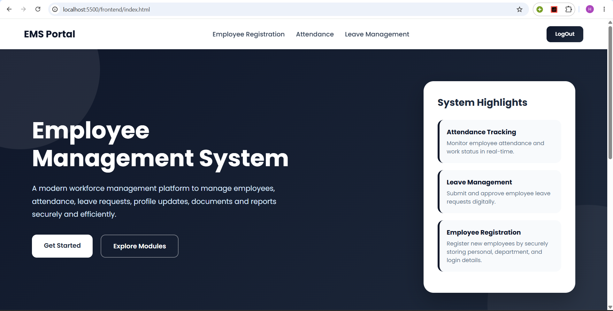
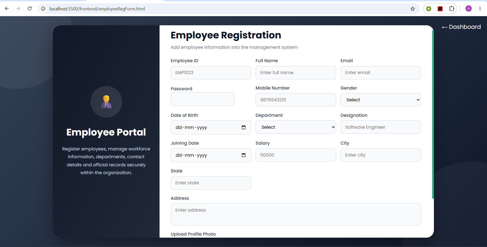
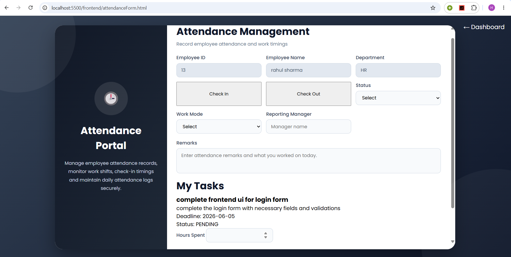
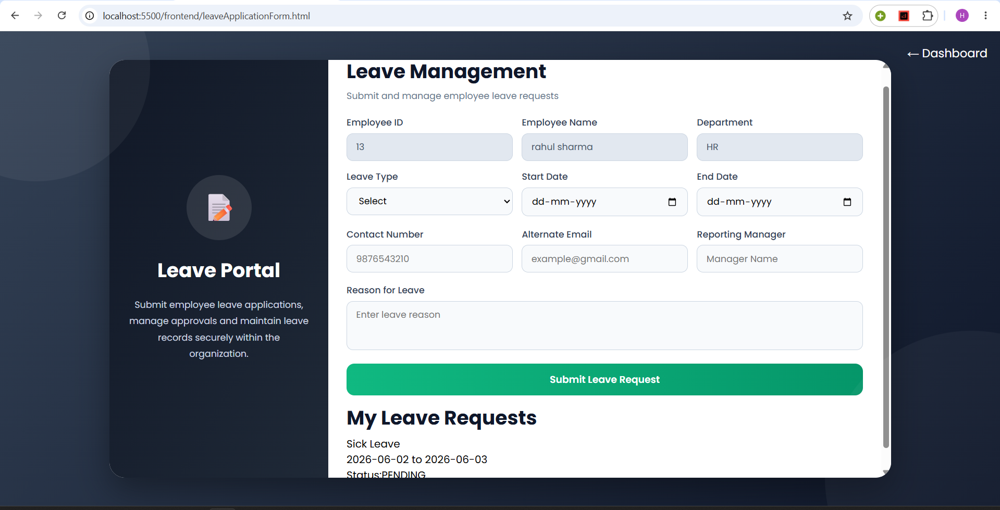
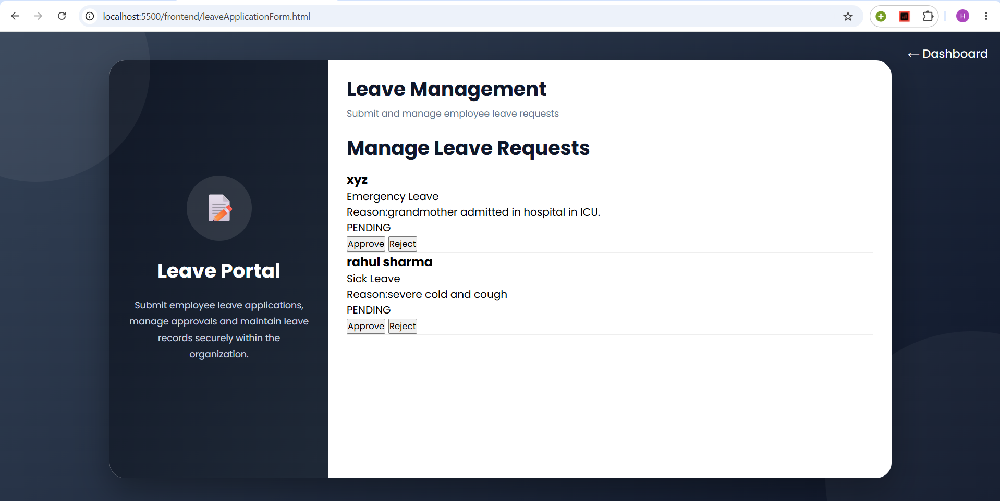
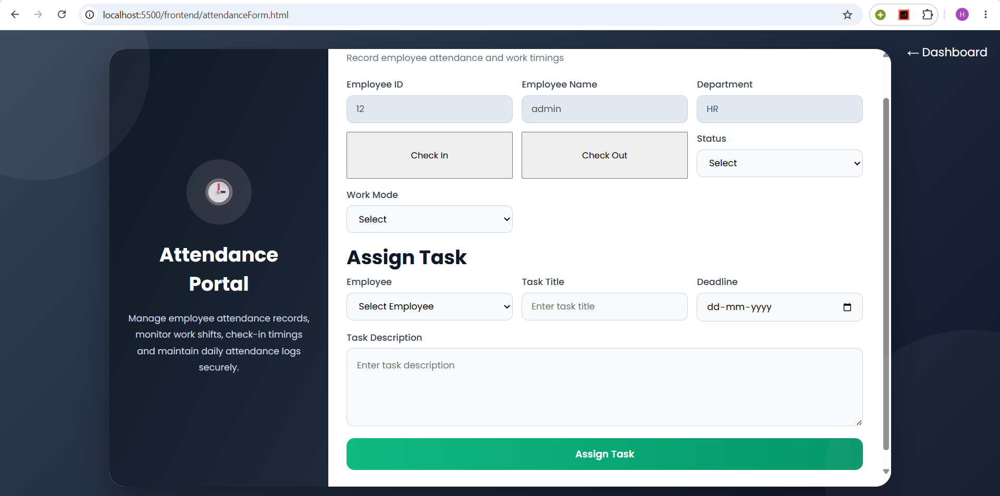

# Employee Management System

## Overview
Employee Management System is a role-based workforce management platform developed using Spring Boot, MySQL, HTML, CSS, and JavaScript. The application enables organizations to streamline employee onboarding, attendance tracking, leave administration, and task assignment through a centralized management system.

## Features

### Authentication & Authorization

* Secure login using JWT Authentication
* Role-based access control (RBAC)
* Roles:
  * Admin
  * HR
  * Employee
* Protected routes and session management
* Unauthorized access prevention
* Token-driven authorization architecture
* Logout functionality

### Employee Registration

* Register new employees
* Upload employee profile photo
* Store employee details securely
* Password encryption using BCrypt
* Password strength validation
* File upload validation (JPG/PNG, size limits)

### Attendance Management

* Employee check-in and check-out
* Automatic working hours calculation
* Attendance records stored in database
* Attendance remarks support
* Role-specific attendance views

### Leave Management

* Employees can submit leave requests
* HR can approve or reject leave requests
* Pending requests displayed separately
* Approved/rejected requests automatically removed from pending list
* Leave status tracking for employees

### Task Management

* Administrative task allocation mechanism
* Employee-specific task visibility
* Deadline-driven task management
* Task completion tracking
* Effort logging through hours-spent recording
* Real-time task status maintenance

### Security Features

* JWT-based authentication
* Password hashing using BCrypt
* Route protection
* Session validation
* File upload restrictions
* Input validation on frontend and backend


### Architecture

Frontend (HTML/CSS/JS)
          │
          ▼
Spring Boot REST APIs
          │
          ▼
Service Layer
          │
          ▼
Spring Data JPA
          │
          ▼
MySQL Database


## Technology Stack

### Frontend
* HTML5
* CSS3
* JavaScript (Vanilla JS)

### Backend
* Spring Boot
* Spring MVC
* Spring Security
* Spring Data JPA

### Database
* MySQL

### Authentication
* JWT (JSON Web Tokens)
* BCrypt Password Encoder

### Development Tools
* Maven
* Git
* GitHub
* Visual Studio Code
* Postman

### Version Control
* Git
* GitHub


## Project Structure

employee-management-system/
│
├── frontend/
│   ├── html pages
│   ├── css/
│   └── js/
│
├── src/main/java/
│   ├── controller/
│   ├── service/
│   ├── repository/
│   ├── entity/
│   ├── dto/
│   └── security/
│
├── src/main/resources/
│   └── application.properties
│
├── uploads/
│
└── pom.xml


## Database Modules

### Users

Stores employee information and login credentials.

### Departments

Stores department information.

### Attendance

Stores check-in, check-out, and working hours.

### Leave Requests

Stores employee leave applications and approval status.

### Tasks

Stores task assignments, status, deadlines, and hours worked.

## Roles and Permissions

### Admin

* Manage attendance
* Assign tasks to employees
* View employee records

### HR

* Review leave requests
* Approve leave requests
* Reject leave requests

### Employee

* Mark attendance
* Apply for leave
* View assigned tasks
* Update task progress


### Screenshots
The following screenshots demonstrate the core functionality of the Employee Management System.

* Dashboard


* Employee Registration


* Employee Attendance


* Leave Management (Employee View)


* Leave Management (HR Review)


* Attendance & Task Assignment (Admin View)



## Installation

### Clone Repository

```bash
git clone https://github.com/HiyaVashi/summer-internship-project.git
```

### Configure Database

Create a MySQL database:

```sql
CREATE DATABASE employee_management;
```

Update:

src/main/resources/application.properties
with your database credentials.

### Run Backend

```bash
mvn spring-boot:run
```

Backend Endpoint:
http://localhost:8080


### Run Frontend

Open the frontend folder using Live Server.

Frontend Endpoint:
http://localhost:5500/frontend


## Future Enhancements

* AI-generated employee work reports
* Dashboard analytics
* Email notifications
* Export attendance reports to PDF
* Performance tracking
* Advanced task management


## Author

Developed as a Full-Stack Workforce Management Solution utilizing Spring Boot, MySQL, JWT Authentication, and modern web technologies.
